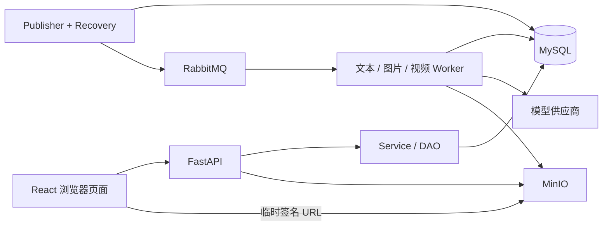

# 系统架构与数据流

本文说明当前实现的边界与不变量；启动见[开发与运行](development.md)，请求格式见[接口约定](api/README.md)，表结构见[数据库设计](数据库模型/MySQL8数据表设计.md)。

## 运行结构

MySQL 是任务状态和业务结果的持久化依据。RabbitMQ 承载调度消息，Celery 不保存业务结果；浏览器通过轮询读取状态，离开页面不会停止后台任务。MinIO 保存图片和视频文件，数据库保存稳定定位值和媒体元信息。

## 前后端分层

前端 `app` 管路由和布局，`pages` 组合页面，`features` 管业务组件与编辑会话，`api/modules` 封装请求，`api/http.ts` 统一错误。正文保存、分镜保存、任务轮询分别维护自己的状态；路由离开保护等待未完成的保存。

后端遵循 API → Service → DAO → ORM。Pydantic 校验请求和输出，Service 验证归属及业务条件，并在一次事务内组合多个 DAO；成功提交、异常回滚。独立 Service 调用应使用尚未开始事务的 Session，返回物化 DTO，不依赖事务外的懒加载。

SQL 外键和 CHECK 约束保护单行及引用完整性；同集归属、素材共享、批次一致、生成来源等跨表规则仍由 Service 校验。不能以“外键允许”为依据绕过这些服务。

## 创作内容与候选

| 对象 | 持久化位置 | 操作语义 |
| --- | --- | --- |
| 项目、分集 | `projects`、`episodes` | 分集创建时继承项目默认风格/画幅，随后独立编辑 |
| 小说、剧本 | `episode_novels`、`episode_scripts` | 每集一份小说、多份剧本候选，最多一份确认剧本 |
| 素材 | `assets` + 三层关联表 | 全局/项目/分集库引用同一素材本体，共享修改需要明确确认 |
| 素材图片候选 | `asset_image_candidates` | 生成、上传或选图先保存候选，确认后改变素材当前图片 |
| 分镜 | `shot_scripts`、`shot_assets` | 服务端编辑、关联、排序；删除为归档 |
| 当前分镜媒体 | `shot_images`、`shot_videos` | 采用结果；替换旧结果进入回收记录 |
| 生成输出 | `ai_generation_records`、`media_assets` | 与当前业务内容分开，未采用结果仍保留 |

小说生成剧本不会改变当前编辑指针；切换候选与确认是独立操作。修改已确认剧本会取消该稿确认，小说修改不会自动修改剧本。生成分镜先保存结构化候选，明确追加或替换后才写入活动分镜。

素材提取只调用文本模型。服务端校验类别、原文依据和结构；用户可编辑候选、选择部分创建或复用素材。AI 输出不直接获得修改已有素材的权限。

## 并发与幂等

| 版本/标识 | 保护范围 |
| --- | --- |
| `episodes.content_version` | 小说、剧本正文、编辑稿切换与确认 |
| `episodes.storyboard_version` | 分镜集合的添加、编辑、排序、归档与图片采用 |
| 分镜 `row_version` + `context_hash` | 单镜头内容与关联素材上下文 |
| 素材、配置、媒体资产 `row_version` | 各自实体的修改或采用 |
| `Idempotency-Key` | 生成、显式重试、新建素材/分镜及提取候选采用 |

过期版本返回 409；客户端应保留用户输入、重新读取并核对，不能自动以新版本覆盖。写入超时不能视为确定失败：正文会话先读取服务器核实，生成请求使用同一请求及幂等键查询/重放。项目和分集创建没有通用幂等保障。

分镜生图使用已保存的文字、时长、画幅、风格及关联素材快照。已确认素材的图片自动作为参考图；图片采用同时比较当前媒体、行版本和上下文。创作内容改变后，旧图仍保存，但需要重新核对。历史来源允许的显式确认不能跳过当前版本冲突检查。

素材生图通过 `asset_image` 来源记录真实素材 ID、提交版本与内容快照。任务历史按素材 ID 共享，不附带入口项目/分集归属；哈希只覆盖影响生成的素材文字字段，不包含当前图片或确认状态。旧结果采用的判断复用同一哈希规则，素材入口与媒体库入口都执行版本、旧来源和共享确认校验。归档中原素材消失时仍保留媒体输出并返回警告；保存恢复可补齐候选，不重复调用模型。

## 异步生成生命周期

1. API 校验模型配置、业务来源和参数，冻结输入快照，事务内创建 `async_tasks` 与调用记录。
2. Publisher 领取投递租约，向对应队列发布消息并处理确认；Recovery 根据持久化证据恢复过期租约与后续动作。
3. Worker 领取任务，执行 `submit`、`poll` 或 `save`。已知供应商任务 ID 优先用于查询；已有文本或媒体 manifest 优先恢复本地归档。
4. 媒体写入 MinIO 并保存元数据；素材生图在同一个受任务租约保护的数据库事务中关联候选并标记归档完成。文本保存原始结果及校验后的业务结果。
5. 浏览器展示候选，用户另行采用；生成成功不等于业务内容已替换。

对外任务状态只有 `queued/running/succeeded/failed/cancelled`。调用记录可以有 `prepared/sent/unknown` 等内部状态；`unknown` 表示无法确定供应商是否受理，不是可无条件重发的失败。

- `cancel` 是尽力取消，不保证远端供应商停止，也不保证没有费用。
- `resume` 使用可恢复证据继续投递、查询或本地保存；是否允许以返回的 `can_resume` 为准。
- `retry` 在允许时创建新任务，复用原输入快照，可选择新的同类模型配置；可能产生新的模型调用费用。
- 想使用编辑后的最新正文，应重新生成，而不是重试旧任务。

内部 `GenerationService.generate_scripts/generate_shots` 负责将已经取得的内容和来源记录原子入库，不调用模型；其 `batch_id` 重放规则与 HTTP 异步生成的 `Idempotency-Key` 不同。

## 模型协议与提示词

`ai/adapters.py` 支持 OpenAI 兼容 Chat/Responses/Images、方舟图片/视频、百炼图片/视频。配置中的供应商显示名不保证协议可用；实际选择还依赖地址和缓存。未知视频协议和不支持的参数会被拒绝。

OpenAI Images 当前采用 generations 协议，不支持 multipart edits；参考图请求会被拒绝。方舟、百炼按模型区分图片编辑、视频首尾帧、分辨率和时长能力。不能把同一组 UI 参数视为所有模型都支持。

业务提示词位于 `backend/src/short_drama/ai/prompts/`，由 registry 组合，通过 `business_prompts` 调用；模板随 Python 包分发。请求记录模板版本和输入快照。结构化输出的最终约束由 Pydantic 定义；提示词不能替代服务端校验。

## 存储、密钥与边界

媒体定位值如 `minio://image/2026/09/23/123.png`，不存临时签名或 Blob URL。签名 URL 在读取时生成，客户端需能访问所配置的 MinIO 地址。未采用生成结果仍保留；回收记录删除不等于物理文件删除，不存在自动垃圾回收承诺。

素材上传已实现实际图片格式、大小、像素检查与 SHA-256 计算；对象写入与数据库事务不能原子提交，失败时按定位值检查后补偿。底层 `StorageService.upload` 本身只验证传输参数和调用方声明的 MIME，不能取代业务上传校验。

AI Key 使用 AES-256-GCM 加密信封，主密钥来自 `ENCRYPTION_KEY`。配置读取只返回 `has_api_key`。更换主密钥前需要迁移已有密文，不能直接覆盖。上游地址受公开 IP 校验和精确主机白名单约束；模型调用不自动跟随跳转，媒体下载单独校验。

当前没有账户或租户隔离，预留的 `created_by/updated_by` 不是权限系统。旧浏览器正文保留显式导入，旧素材/制作记录可下载；模型选择属于浏览器偏好，业务正文和采用结果以服务端为准。

## 后续开发边界

接下来完成选定模型的参考图联调、分镜视频业务来源/候选/采用，再实现最小成片导出。现有视频任务和 `shot_videos` 是可复用基础，但当前分集页面没有视频制作步骤。音频、字幕、剪辑、宫格切图和多用户权限尚未实现。
