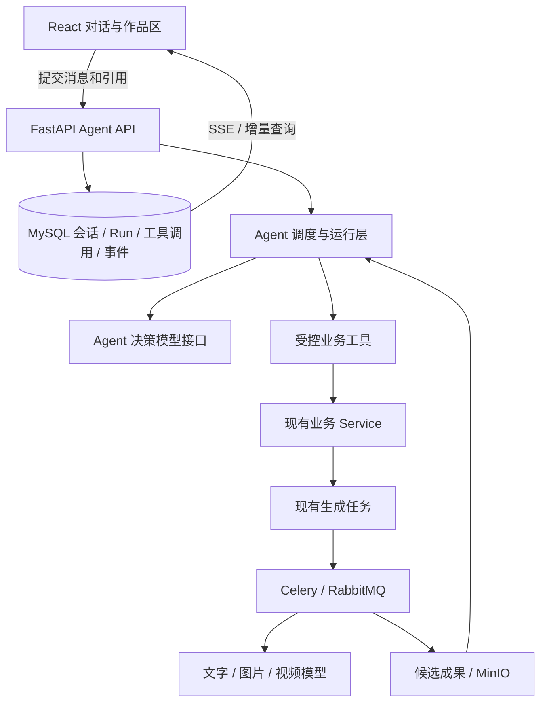

# Agent 创作模式：技术栈调研与接入建议

调研日期：2026-10-02。范围：公开产品文档、公开源码和本项目当时实现。本文保留调研时的技术判断；当前接入方案、实施进度与验收证据以 [Agent 模式实施契约](2026-10-02-agent-mode-implementation.md) 为准，真实模型兼容性单独记录。

## 1. 结论

在现有 Python 后端新增 Agent 层，继续使用 React、FastAPI、SQLAlchemy/MySQL、Celery/RabbitMQ、MinIO。两种创作模式共享作品、候选、模型配置和生成任务。

框架首选 **PydanticAI + 项目自己的持久化运行状态机**。PydanticAI 的强类型工具和 Deferred Tools 适合“单协调器 + 等待既有媒体任务 + 用户审核”。这是源码与文档调研后的建议，还需要一个小型运行验证，不能视为已集成或已测通。

首版采用一个创作协调 Agent、按需加载的创作 Skill，以及受控业务工具。先完成当前剧本、分镜的对话修改，再接入当前对象的图片、视频任务。

Agent 框架只处理模型交互和工具选择；持久化运行、长任务衔接、权限、预算、幂等和成果采用由项目自己的业务层负责。首版不需要因为引入 Agent 同时增加 Node 后端、PostgreSQL、Redis、向量数据库或 Temporal。

## 2. 参考产品：能确认什么

### Flova：规格、Skill 和项目工具共同驱动创作

已读取官方 [Agent 文档](https://www.flova.ai/zh-CN/docs/features/agent/)、[Skill 文档](https://www.flova.ai/zh-CN/docs/features/skills/)、[CLI 文档](https://www.flova.ai/zh-CN/docs/features/flova-cli/)和[快速入门](https://www.flova.ai/zh-CN/docs/introduction/quick-start/)。

公开文档把 Agent 定义为读取项目状态、调度创作模块的操作者，包含规划、素材理解、故事板设计、媒体生成、剪辑组装。三个上下文对象分工明确：

| 对象 | 作用 | 本项目的对应设计 |
| --- | --- | --- |
| 用户本轮要求 | 这次要完成什么 | 用户消息及所选对象 |
| Final Video Spec | 当前视频的画幅、语言、时长、风格 | 项目/分集规格与本次任务约束 |
| Skill | 某类视频的制作方法、工具使用和检查节点 | 版本化的创作流程指南 |

单素材任务通常不需要建立完整成片规格或加载完整 Skill。结果进入故事板、媒体、文档及剪辑区域；对话显示执行步骤。手动编辑与 Agent 并行修改同一对象时，文档描述了冲突处理；还描述了按消息回退和创建分支。

Flova CLI 是外部 Agent 接入完整项目系统的入口，文档明确项目需求、历史、故事板、媒体、文档和时间线保留在同一项目中。

**借鉴点：** 任务要求、作品规格、制作方法分别管理；对话操作正式作品对象；小任务与完整视频任务采用不同执行范围。

**证据边界：** 没有找到这些公开文档披露其内部 Agent 框架、数据库或调度器；不能据此断言它使用 LangGraph 或多个独立 LLM Agent。回退/分支属于值得参考的后续能力，本项目首版不承诺全项目快照回滚。

### LibTV：公开的是外部 Agent 的 Skills/OpenAPI 接入

官方仓库：[libtv-labs/libtv-skills](https://github.com/libtv-labs/libtv-skills/tree/c609246c1eca69f6bc129bcbb5d64c36734e4a4a)。本次读取固定 commit `c609246c1eca69f6bc129bcbb5d64c36734e4a4a` 的 README、SKILL 和六个 Python 脚本。

[SKILL 的核心原则](https://github.com/libtv-labs/libtv-skills/blob/c609246c1eca69f6bc129bcbb5d64c36734e4a4a/skills/libtv-skill/SKILL.md#L221)规定：外部 Agent 上传参考资料、转发原始用户请求、获取结果；后端 Agent 负责理解需求、拆分镜、编排工作流、选模型及写提示词。

公开客户端可确认：

- 会话创建返回 `sessionId` 和 `projectUuid`，作品项目与对话会话分别标识。
- 同一个 `sessionId` 支持后续自然语言指令。
- 查询会话使用 `afterSeq` 增量读取消息，便于继续观察后台任务。
- 文本与 tool 消息承载媒体结果，输出可返回项目画布链接。
- 客户端为 Python 标准库脚本，没有证明后端使用某个 Agent 框架。

来源：[API 封装](https://github.com/libtv-labs/libtv-skills/blob/c609246c1eca69f6bc129bcbb5d64c36734e4a4a/skills/libtv-skill/scripts/_common.py#L73)、[结果下载解析](https://github.com/libtv-labs/libtv-skills/blob/c609246c1eca69f6bc129bcbb5d64c36734e4a4a/skills/libtv-skill/scripts/download_results.py#L17)。

**借鉴点：** 后端掌握编排；会话、运行和作品分开建模；事件具有顺序号和恢复游标；媒体作为正式引用。

**证据边界：** 没有公开内部 Agent 服务端、checkpoint、预算或幂等实现。README 的上传路径与实际脚本存在差异，不能视为已联调接口。SKILL 提到 Redis 缓存，但仓库没有对应服务端源码，不能以此推导完整技术栈。本项目每个会话和运行应显式绑定项目，避免照搬 accessKey 隐式切换“当前项目”的状态。

### BeefTV：核实当前入口与历史实现

公开仓库：[glanderness/BeefTV](https://github.com/glanderness/BeefTV/tree/bcc3b05afa9e4e2bf9e13b5eb04e047438cb677b)。本次固定 commit `bcc3b05afa9e4e2bf9e13b5eb04e047438cb677b`。

源码保留 Go `cloud_agent` 及 TypeScript 创作 Agent 相关实现，但当前源码中的退休测试明确旧内置 Agent 产品入口已停用。README 的 Agent 描述不能替代当前运行入口核验。

直接证据包括 [task_creation.go](https://github.com/glanderness/BeefTV/blob/bcc3b05afa9e4e2bf9e13b5eb04e047438cb677b/backend/internal/app/task_creation.go#L19) 对旧 Agent 任务的拒绝、[task_worker.go](https://github.com/glanderness/BeefTV/blob/bcc3b05afa9e4e2bf9e13b5eb04e047438cb677b/backend/internal/app/task_worker.go#L37) 不再启动旧调度器，以及[前端入口退休测试](https://github.com/glanderness/BeefTV/blob/bcc3b05afa9e4e2bf9e13b5eb04e047438cb677b/web/test/agent-product-entry-retired.test.tsx#L107)。

历史实现具有明确的 Agent 机制：等待文本任务 → 解析工具调用 → 顺序执行并反馈 → 发起下一模型轮次。运行状态、工具队列、预算、审批、计划和事件持久化；工具可以读写画布/分镜、查询模型能力、生成媒体、查询任务、提问及管理技能。写入要求最新 snapshot hash；事件有顺序号；协议层统一消息和工具，再适配 Chat Completions、Responses、Claude、Gemini。

来源：[历史运行循环](https://github.com/glanderness/BeefTV/blob/bcc3b05afa9e4e2bf9e13b5eb04e047438cb677b/backend/internal/app/cloud_agent_runtime.go#L477)、[领域工具](https://github.com/glanderness/BeefTV/blob/bcc3b05afa9e4e2bf9e13b5eb04e047438cb677b/backend/internal/app/cloud_agent_tools.go#L111)、[协议适配](https://github.com/glanderness/BeefTV/blob/bcc3b05afa9e4e2bf9e13b5eb04e047438cb677b/backend/internal/app/provider_agent_protocol.go#L11)。这是自建 Go 运行层，读取的 package/go.mod 没有显示 LangGraph、LangChain 或 Vercel AI SDK 依赖。另保留 TS CreativeAgentController 与创作 API，但当前创作页未接入该控制器，本次没有验证可触达 UI。

**借鉴点：** 领域工具、持久运行和事件、来源版本、生成预算可以参考；不能直接描述为当前已启用的产品能力，也不能因为参考了它就迁移本项目后端到 Go。仓库为 MIT，有上游版权及第三方依赖边界；本次没有移植源码。

## 3. Agent 框架比较与选择

| 候选 | 已核实能力 | 与当前架构的成本/边界 | 结论 |
| --- | --- | --- | --- |
| PydanticAI | 强类型工具与结果；Deferred Tools 支持审批、外部执行和后台慢任务；消息历史可 JSON 序列化 | 应用自行保存 history、待处理 tool call 与 job ID；核心持久化不等于任意执行位置的崩溃恢复 | 首版优先，搭配本项目持久化 Run 层 |
| LangGraph | 按 super-step checkpoint；interrupt 暂停和恢复；适合分支及跨步骤恢复 | 官方 checkpointer 集成清单未列 MySQL；需社区 MySQL saver 或自建适配，另维护图状态 | 跨阶段复杂执行、分支和回放需求扩大后优先评估 |
| OpenAI Agents SDK | 工具调用、审批、可序列化 RunState；SQLAlchemySession 文档支持 MySQL | Session 主要保存会话；MySQL 需异步驱动，不能直接等同当前 PyMySQL 配置；其他模型需验证工具协议 | OpenAI 模型为主时是合理备选 |
| 纯自建模型循环 | 可完全匹配业务协议与执行策略 | 需要自行维护 provider 工具协议、流式解析、验证与生态变化 | 自建业务运行层，模型协议层优先复用成熟框架 |

PydanticAI 的 Deferred Tools 路径可以在慢任务提交后结束当前模型运行，保存消息和待处理调用；媒体任务完成后，通过 `message_history + DeferredToolResults` 开始后续运行。这样 Agent 不需要一直占用连接等待媒体生成。本项目可以通过 SQLAlchemy/MySQL 保存这些状态，无须为此引入另一个数据库。

PydanticAI 不负责替本项目保障提交前后的所有崩溃恢复。需要持久化工具意图、生成任务关联和返回结果，恢复时先查询已有任务。若模型响应在落库前中断，可能需要重做该轮决策，并产生新的文本费用；不能据此重复提交已受理的媒体任务。

LangGraph 官方提供更完整的图式状态与恢复，但中断恢复可能重跑节点代码，副作用仍须幂等。已核实社区 [tjni/langgraph-checkpoint-mysql](https://github.com/tjni/langgraph-checkpoint-mysql) 提供同步/异步 saver；它不是官方维护后端，数据库版本和迁移限制要与本项目实际 MySQL 版本验证。不能把“支持 checkpoint”直接等同于“已兼容本项目 MySQL”。

OpenAI Agents SDK 官方 SDK 文档支持兼容端点、自定义 provider，以及 SQLAlchemySession/MySQL；部分跨 provider 集成标为 best-effort beta。Session、RunState 和完整 durable orchestration 是不同能力。框架默认外部 tracing 需按项目数据策略显式配置，不默认把作品内容发送至外部观测平台。

本次已读取的来源：

- PydanticAI：[Deferred Tools](https://ai.pydantic.dev/deferred-tools/)、[Persistence](https://ai.pydantic.dev/persistence/)、[Durable Execution](https://ai.pydantic.dev/durable_execution/)、[Observability](https://ai.pydantic.dev/logfire/)。
- LangGraph：[Checkpointers](https://docs.langchain.com/oss/python/langgraph/checkpointers)、[Interrupts](https://docs.langchain.com/oss/python/langgraph/interrupts)、[后端清单](https://docs.langchain.com/oss/python/integrations/checkpointers/index)。
- OpenAI Agents SDK：[Human-in-the-loop](https://openai.github.io/openai-agents-python/human_in_the_loop/)、[SQLAlchemy Session](https://openai.github.io/openai-agents-python/sessions/sqlalchemy_session/)、[Models](https://openai.github.io/openai-agents-python/models/)、[Running Agents](https://openai.github.io/openai-agents-python/running_agents/)。OpenAI 主文档域名请求被拒绝，SDK 站点可读取；本次不据此判断具体模型、价格或账户可用性。

任何框架都不能代替应用保证第三方媒体 API 的 exactly-once 提交。这个边界要继续由现有任务受理证据、幂等和恢复规则处理。

## 4. 本项目已有基础与实际缺口

| 能力 | 当前源码状态 | 接入策略 |
| --- | --- | --- |
| React 19 / TypeScript / Vite / Ant Design | 已有作品编辑及候选预览界面 | 新增对话、上下文引用、运行及成果卡片 |
| Python 3.12 / FastAPI / Pydantic | 已有 API、验证和业务服务 | 在同一后端新增 Agent API 与运行层 |
| SQLAlchemy / MySQL | 保存账号、作品、候选、任务和版本 | 新增会话、消息、运行、工具调用、事件 |
| Celery / RabbitMQ | 生成任务具有发布、查询、归档和恢复流程 | 增加 Agent 调度，复用原媒体长任务 |
| MinIO | 稳定媒体 ID 与文件存储 | 工具使用媒体 ID，读取时再生成访问地址 |
| 模型配置与密钥 | 用户配置、密钥加密、受限传输 | Agent 决策模型复用配置，增加能力校验 |
| 候选及采用 | 生成与当前作品分开，采用检查来源和版本 | Agent 输出继续进入候选体系 |
| 账号及协作 | Actor、项目范围、CSRF、后台任务权限 | Agent 工具执行和恢复继承同一授权链 |

关键缺口来自源码，而非文档名称：

1. `schemas/ai_generation.py` 的 `TextMessage` 只有 `system/user/assistant` 和字符串正文；`ai/adapters.py` 拒绝其他字段。现有协议不支持 `tools`、`tool_calls`、工具结果消息及结构化多模态内容。
2. 现有 `stream=true` 在 Worker 内部收集；`ai/transport.py` 读取完整响应，`ai/streaming.py` 将完整 SSE 转换成最终内容。前端仍然轮询任务，没有端到端流式聊天。
3. `AsyncTask` 描述一次 text/image/video/audio 生成，其 submit/poll/save 状态不足以表达 Agent 的多步运行、等待工具和等待用户。
4. 现有小说改编能保存候选剧本，但“基于当前剧本局部改写”没有完整的来源与候选语义。直接调用 `save_script` 会修改当前编辑稿并取消确认，不能作为 Agent 默认的成果保存方式。

本项目部分架构文档仍包含旧能力边界，如账户、音频、图片编辑相关描述；本次以实际源码为依据，没有附带修改那些文档。

## 5. 建议的运行结构

Agent 决策模型负责理解目标、选择工具和解释结果。图片、视频生成仍由对应模型及现有任务执行器处理。先提供一个协调 Agent；“剧本、素材、分镜、视频”等模块优先表达为 Skill 和工具，避免首版出现多个 Agent 互相对话却难以控制任务状态的情况。

建议独立封装 `AgentModelGateway`：由 PydanticAI 的模型 provider 承载工具消息协议，项目封装可信模型配置、能力校验、用量及传输。它与原单次生成接口分开，不把 `TextMessage` 的限制强行放开后交给所有现有适配器。

框架默认 HTTP 客户端不能绕过项目已有地址限制、凭据保护与传输控制。接入时需验证受控 client/transport 注入方式；工具调用、流式事件、多模态内容、实际模型和代理协议分别做能力验证。Agent 决策模型与图片/视频模型可分别配置，不能把“文本生成可用”当作“工具调用可用”。

### 会话、运行和生成任务分开

- Conversation：绑定项目、分集及可选对象，保存连续协作历史。
- Message：用户要求、助手内容、明确引用和结构化成果。
- Run：本轮目标对应的执行实例，包括发起人、范围、预算、状态和恢复点。
- Tool call：工具名、验证后的输入、幂等键、输出、关联生成任务及错误。
- Event：具有单调顺序号的 UI 事件，支持断线恢复。

建议新增 `agent_conversations`、`agent_messages`、`agent_runs`、`agent_tool_calls`、`agent_events`。Skill 首期可以版本化资源文件管理，用户自定义和团队共享再引入相应存储。

Run 可包含 `queued`、`running`、`waiting_generation`、`waiting_review`、`succeeded`、`failed`、`cancelled` 等状态。实际命名在实现契约中统一。

运行一小段后持久化状态、释放 Worker。图片/视频完成后，按已记录任务恢复 Agent；不能占用一个 Worker 十几分钟反复等待。Agent Run 与已有生成任务建立关联，不把一轮对话强行塞进 `ai_generation_records`。

### 工具与成果

第一批工具建议包括：

| 工具 | 作用 | 结果 |
| --- | --- | --- |
| `read_episode_context` | 读取本集规格、正文及当前确认关系 | 带版本的上下文 |
| `read_shot_context` | 读取选中镜头及关联素材 | 镜头、素材和参考媒体 ID |
| `list_assets` | 查询当前范围可用素材 | 可引用对象列表 |
| `create_script_revision_candidate` | 基于指定剧本产生局部或整体改写 | 新候选及父版本来源 |
| `generate_shot_image` | 发起当前镜头生图 | 原生成任务 ID |
| `generate_shot_video` | 使用有效已采用分镜图发起视频 | 原生成任务 ID |
| `get_generation_status` | 查询已受理任务 | 状态、候选及媒体 ID |
| `propose_apply_candidate` | 提供明确采用提案 | 目标、候选、来源与影响范围 |

模型不能直接执行 SQL、任意 HTTP 或服务器 Shell。工具通过现有 Service 访问作品并执行版本检查。读取工具与生成/写入工具分别设置权限；实际采用、确认和共享素材修改继承当前业务规则。

成果应包含 `artifact_type`、`target_id`、`candidate_id`、`media_id`、来源版本和状态，而不是仅返回 Markdown 链接。这样聊天卡片与作品面板可引用同一个结果。

### 上下文与 Skill

作品数据是事实来源，对话摘要是辅助记忆。每轮按范围读取当前正式版本、选中对象和用户显式引用；媒体通过稳定 ID 引用。旧版本变动时提示核对，不能把长期对话中的旧设定当作当前作品状态。

复用现有 `ai/prompts` 的专业规则，并将流程规则整理为可按需加载的 Skill：适用范围、依赖输入、允许工具、制作顺序和检查节点。Skill 记录版本；运行保留所用版本与输入快照。

首期按对象 ID、场景或分集获取上下文；长正文可按章节/场景截取。没有跨大量作品语义检索需求之前，向量数据库不是必要基础设施。

### 事件与前端

建议 POST 提交消息，GET SSE 订阅 Run 事件，同时提供按 `after_seq` 增量读取的 REST 恢复接口。事件类型覆盖消息增量、工具开始/完成、生成状态、候选就绪、需审核及 Run 终态。

同源 SSE 可以使用现有 HttpOnly session cookie；写请求继续使用 CSRF。不能把 API Key 或长期会话 token 放进订阅 URL。跨域部署另行核实 cookie、CORS 和 credentials 配置。

SSE 断开不取消运行，重连按事件 ID 恢复；恢复不能重新调用模型。持久化 UI 所需事件，正文增量可合并成块，避免每个 token 一次事务。事件流与现有 15 秒 Axios 请求超时分开配置，并检查代理缓冲及连接超时。

首期前端沿用 React 和 Ant Design 即可。Vercel AI SDK、AG-UI、MCP 是可选的协议或集成工具，不能代替后端的作品状态、权限与持久化运行。

### 权限、恢复与费用

- Run 绑定可信 Actor 和明确项目范围；恢复后、每次新付费提交前重新校验权限。成员离开项目不能继续触发新生成，已受理任务按既有规则保全成果。
- 工具执行使用稳定的 Run/tool call 幂等键。恢复先读调用记录和已有任务，受理不明时沿用现有核查规则，不能自动重发。
- 模型、工具和 UI 三层均不得把“生成完成”等同于“作品已采用”。来源变动和并发冲突仍由业务 Service 校验。
- 设置每轮最大模型轮次、生成数量、并发数、时长和预算。无法可靠获得报价时显示调用额度与已知用量，不伪造预计金额。
- 停止 Run 阻止后续步骤；已提交媒体任务按供应商取消能力处理，不承诺取消就不计费。
- 首期记录 Run、工具和生成的关联 ID、用量、耗时及结构化错误。提示词和参考资料作为项目数据管理，日志不记录密钥或完整请求凭据。

## 6. 建议技术栈与首版验证范围

| 层 | 首版建议 |
| --- | --- |
| UI | React 19 / TypeScript / Ant Design；对话与作品区共享成果 ID |
| HTTP | FastAPI；消息提交 REST，事件 SSE，增量恢复 REST |
| Agent 模型循环 | PydanticAI；实现时选择必要 provider 依赖并锁定兼容版本 |
| Agent 业务执行 | 项目自己的 Run/Tool/Review 状态机、租约、恢复和预算 |
| 持久化 | 现有 SQLAlchemy / MySQL，新增会话与运行表 |
| 长任务 | 现有 Celery / RabbitMQ / Publisher / Recovery；单独 Agent 调度入口 |
| 媒体 | 现有生成 Service、模型适配、候选机制、MinIO |
| 创作方法 | 现有提示词规则 + 按需加载的版本化 Skill |
| 观测 | 本地结构化运行记录；需要跨服务观测时可接 OpenTelemetry，外部平台可选 |

先验证当前剧本/分镜的一个完整闭环：用户目标 → 正确引用当前版本 → 产生候选 → 对话修改 → 明确采用。随后加入选中镜头的图片和视频任务及恢复。

技术试验需验证：

1. 配置中的实际决策模型能正确发起工具调用，工具参数经过 Pydantic 验证；不能以“兼容 OpenAI 地址”推断工具调用可用。
2. 两轮局部修改能保留明确约束，生成新的候选而不是覆盖确认稿。
3. 等待图片/视频时释放 Agent 执行资源，任务完成后继续；刷新和服务重启能恢复。
4. 同一 tool call 重放只关联同一个生成任务；供应商受理不明不会触发重复计费请求。
5. 手动修改、其他协作者修改、撤权后恢复都执行当前版本与权限校验。
6. SSE 重连不丢失终态和成果，也不会重复触发生成。
7. 达到预算/调用上限后停止后续步骤，前端能解释剩余可选操作。

基础验证可使用可控模型与任务替身；真实模型兼容性、费用和媒体质量需要单独的小规模实际联调。本次仅做公开资料和源码调研，没有调用付费模型。

首版之后再评估跨镜头批量、跨阶段执行、用户自定义 Skill、外部 Agent/MCP 接入，以及全项目回退与分支。它们是独立能力，不由“增加聊天入口”自动获得。
