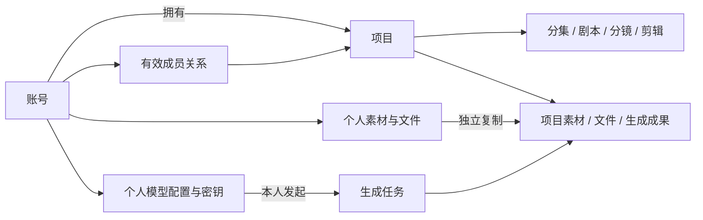

# 用户、权限与项目共同创作：设计和实施记录

本次在原有业务表和工作流上增加账号、项目成员和资源归属。项目由一个个人账号拥有，主人邀请协作者共同创作；每位成员使用自己的模型配置和密钥，产出归项目保留。现有业务数据库没有执行迁移。

## 已确定的产品边界

- 账号采用唯一账号名与密码，注册后必须验证绑定邮箱。显示人名允许重名。
- 项目角色只有主人和协作者。首期没有独立团队空间、只读访客、企业 SSO、实时光标、评论或任务分配。
- 主人管理成员、邀请与项目归档；协作者编辑项目、分集、素材、分镜和剪辑内容，可主动退出。
- 邀请搜索支持人名、账号名、账号 ID 和邮箱。人名搜索必须选择具体账号；未注册受邀人必须指定邮箱。
- 邀请绑定账号 ID 或指定邮箱，七天有效，一次使用，可撤销。每次接受邀请都需要新的邮箱证明，注册验证不能代替邀请验证。
- 成员使用各自的模型配置、默认模型和 API 密钥。其他成员可查看项目生成结果，不能使用或管理发起人的配置。
- 导入个人或其他项目的素材，复制素材本体、当前图片和参考图的物理文件。生成历史、模型配置及项目音色绑定不随素材导入。本项目内的素材可以在项目与分集中引用同一本体。
- 主人可取消任意项目任务；协作者只能取消自己的任务。重试及恢复由原任务发起者操作。产出不会因成员退出或被移除而删除。
- 版本冲突返回 409，当前输入保留，由用户读取最新版本并手动合并。沿用正文、分镜、素材、声音和剪辑既有版本机制。

## 数据模型

原有 32 张业务表保留，新增 11 张表，完整初始化结构现为 43 张表。`created_by/updated_by` 记录实际操作人，不参与所有权判断；历史未知作者保持为空。

| 新增表 | 职责与关键约束 |
| --- | --- |
| `users` | 唯一账号名、唯一规范化邮箱、Argon2id 密码摘要、邮箱验证时间、账号状态 |
| `user_sessions` | 仅保存会话及 CSRF 令牌的 SHA-256 摘要；过期和撤销检查 |
| `email_challenges` | 绑定账号、邮箱、用途和邀请 ID 的短期证明；失败次数持久化，最多五次 |
| `project_members` | 项目与账号唯一成员关系；active/removed/left 状态 |
| `project_invitations` | 只保存邀请令牌摘要；账号 ID 与指定邮箱互斥；接受和撤销状态 |
| `audit_events` | 操作人、对象、项目、操作类型、请求 ID；不保存正文、密码或密钥 |
| `user_model_preferences` | 按账号和创作上下文保存本人模型选择 |
| `user_project_states` | 每个账号独立的项目最近打开时间 |
| `email_outbox` | 加密邮件载荷、发送租约、重试、发送后清除和过期清理 |
| `auth_rate_limits` | 跨 API 进程的持久化限流计数 |
| `resource_imports` | 幂等复制收据、冻结快照、稳定目标 ID、租约、重试、结果和失败清理 |

`projects.owner_user_id`、`ai_model_configs.owner_user_id` 和 `global_assets.user_id` 最终非空。原 `/libraries/global` 路径保留兼容，其含义是当前账号的个人素材库。

`assets/media_files/async_tasks/generation_batches` 各增加 `scope_user_id/project_id`，CHECK 强制二者恰好一个非空。资源属于个人或项目；项目资源不会因创建者退出而转为个人资源。项目之下的小说、剧本、分镜、媒体候选、音色、声音和剪辑继续沿业务父链解析归属，不重复增加所有者字段。

异步任务、批次和渲染任务增加 `initiated_by`。模型默认值唯一约束改为“账号 + 服务类型”，个人素材排序唯一约束改为“账号 + 位置”。项目与分集设置增加乐观版本；最近打开时间移至个人状态表。

## 权限与执行边界

| 操作 | 主人 | 协作者 | 项目外账号 |
| --- | --- | --- | --- |
| 读取与编辑项目创作内容 | 允许 | 允许 | 404 |
| 邀请、撤销邀请、移除成员 | 允许 | 403 | 404 |
| 归档项目 | 允许 | 403 | 404 |
| 主动退出 | 不允许 | 允许 | 404 |
| 查看项目任务和产出 | 允许 | 允许 | 404 |
| 取消项目任务 | 所有任务 | 仅本人 | 404 |
| 重试、恢复任务 | 仅本人 | 仅本人 | 404 |
| 模型配置及个人素材 | 仅本人 | 仅本人 | 404 |

HTTP 中间件验证账号、会话、Origin 与 CSRF，并在请求 Session 中设置可信 Actor。所有 ORM 列表、详情、JOIN、别名、计数和批量查询统一应用范围过滤；未经检查的 Core 查询和所有权/引用批量更新禁止进入账号 Session。Service 的事务和写入检查负责成员状态、不可变归属及同范围引用。

认证、邀请接受、运维迁移和后台 Worker 使用明确的系统 Session，分别执行显式检查。锁顺序以项目为起点，再到配置、批次或任务，减少撤权与任务提交的死锁。新生成在写入 `sent` 的事务中再次检查发起人的有效成员身份；这个已授权的提交预约是本地提交边界。外部调用在事务之外执行，供应商受理存在网络不确定性，不能承诺撤权能撤回已预约或供应商已受理的调用。

移除成员会终止未提交任务、待执行批次、复制任务和待执行渲染。已受理任务可以继续查询和归档已有结果，不自动采用。重新邀请不会复活原来的待执行任务。归档项目保留历史内容，停止新提交；恢复归档目前需运维处理。

媒体签名链接最长五分钟，重新签发必须先通过权限检查。已签发链接在过期前仍可能使用。邀请页面使用 no-referrer，应用 access log 对邀请令牌脱敏；反向代理也必须采用相同的脱敏规则。

## 三项 Goal 的三段式验证框架

每项 Goal 都用“完成标准 / 持续不变量 / 验证证据”判断，不用页面是否出现按钮代替安全验证。

| Goal | 完成标准 | 持续不变量 | 证据 |
| --- | --- | --- | --- |
| **Goal 1：可信身份与定向加入** | 注册、邮箱验证、登录、退出、找回密码、定向邀请及接受闭环 | 不保存明文密码或令牌；未验证邮箱不能进入创作；证明绑定用途与邀请；错误尝试提交；重复接受不重复添加成员 | `test_identity_collaboration.py`：注册、CSRF、用途/邀请绑定、并行接受、指定邮箱、过期/撤销、密码重置后的会话失效；浏览器桌面/手机验证码错误重试 |
| **Goal 2：资源隔离与安全迁移** | 个人资源隔离，项目父链与查询全部受控，历史数据可明确归属并安全拆分 | 注册不领取历史数据；禁止跨范围可写引用；模型密钥只属于本人；缺失迁移阻止启动；失败回滚，重复迁移不重复复制 | 同文件：列表/计数/别名/子路径/配置隔离/引用拒绝；`test_collaboration_migration.py`：旧结构扩展、明确归属、三份独立资源、候选重连、失败清理、finalize 和重复执行 |
| **Goal 3：可持续共同创作** | 成员共同编辑，使用个人模型，复制资源，审核产出，撤权后保留成果 | 409 不覆盖编辑；任务控制遵守发起者规则；撤权阻止新提交且不复活旧任务；物理复制独立；导入幂等；账号切换不读取他人草稿 | 真实 MySQL 的任务/复制/撤权测试，真实 MinIO 复制字节与源删除测试；浏览器登录过期保留输入、版本合并和重名选人；前端账号草稿与收据隔离测试 |

验证数据使用随机命名的独立 MySQL 测试库；MinIO 测试仅创建唯一前缀的临时对象并清理。模型供应商使用替身，没有付费调用。SMTP 通过邮件替身验证队列和证明消费，实际收信仍需部署环境配置并验收。

## 最终验证记录（2026-10-02）

| 验证层 | 结果 | 覆盖 |
| --- | --- | --- |
| 后端单元与 API | 570 项通过 | 既有工作流、领域与完整 SQL 契约、接口校验和存储 |
| 完整 MySQL 集成回归 | 144 项通过，2 项未启用 | 写作、素材、生成、声音、原生音色、剪辑、身份权限与历史迁移；含真实 MinIO 复制与源删除 |
| 最终迁移专项 | 9 项通过（其中新增 3 项） | CHECK 禁用/改写、关键外键和唯一约束缺失时阻止启动；没有活动子任务的运行/暂停/待审核批次也阻止迁移；拆分、回滚和重入 |
| 前端逻辑 | 124 项通过 | 账号草稿与幂等收据隔离、编辑与任务状态 |
| 浏览器 | 13 项通过 | 桌面/手机邀请、错误验证码、同账号过期恢复、错误账号切换、409 合并、浏览器存储禁用与旧创作流程 |
| 构建与静态检查 | TypeScript/Vite 构建、Ruff 检查及 git diff --check 通过 | 前后端构建与补丁检查 |

MySQL 两项未启用的是独立 RabbitMQ/Worker 的外部服务测试。单元/API 与集成测试使用不同 Python 进程，避免仓库中同名测试模块的导入冲突。完整回归与最终迁移专项共验证 147 个不同的 MySQL 测试。

邮箱清理额外覆盖：SMTP 未配置时回收失效或已消费的邮件载荷，过期发送租约可回收，有效发送租约保留。复制清理覆盖存储删除失败后重试、已提交媒体保护、延迟 Worker 重开清理及稳定目标恢复。

当前业务库仅做只读预检：缺 11 张协作表与 17 个字段；现有 1 个项目、8 个素材、23 个媒体文件、4 份模型配置、35 个生成任务、0 个批次。预检时活动生成、渲染和批次均为 0；这是当时的观察结果，实际迁移前仍必须停写并重新预检。未执行 expand/backfill/finalize，未创建初始账号，也未发送真实邮件。

## 实施与部署

代码已覆盖账号接口、成员和邀请接口、个人模型偏好、项目活动、资源复制 Worker、统一权限检查、协作页面和会话过期编辑恢复。密码哈希依赖已写入 `pyproject.toml/uv.lock`。

历史库采用 expand → 显式 backfill → finalize，具体命令见 [部署与迁移说明](../collaboration-deployment.md)。迁移不会在应用启动时运行，启动时只检查是否完成。

迁移前备份 MySQL 与对象存储，停止 API、调度器和 Worker，排空或明确取消活动生成、渲染及批量工作。明确选定已验证账号作为历史归属者；跨项目共享素材和文件拆分为独立副本，关系及受支持 JSON 引用重新连接，受影响项目的旧生成上下文标为需人工复核。未知引用会阻止提交，不能猜测其归属。

新增数据库使用完整 `schema.mysql8.sql`；已有库先完成其他已启用生产功能对应迁移，再执行协作迁移。上线后至少用两个真实账号验证注册收信、邀请新证明、模型独立、共同保存、撤权和签名链接过期。既有业务数据不被本次开发测试改写。

后续增加团队空间或更多角色时，可在现有项目归属与权限能力层上扩展；不应把 `created_by` 改作租户字段，也不应默认共享密钥。首期所有者转让、开放注册链接邀请和公开项目不在范围内。
