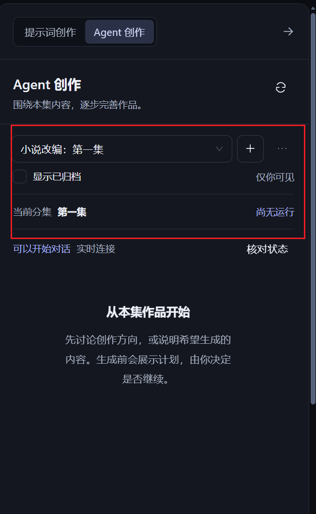
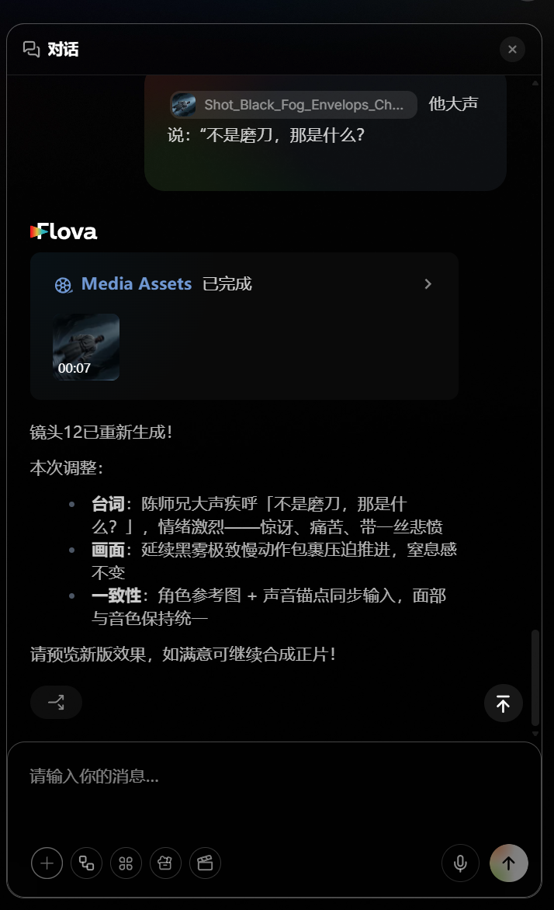

/goal 以下是对分集详情页中各个流程的精细化修改，涉及到前后端的修改
## 核心规则
前端设计采用 $design-taste-frontend 读取这个skill的指导进行设计并修改
前端react组件封装，性能优化 采用$vercel-react-best-practices 这个skill的指导进行封装设计
前端的code review 采用frontend-code-review这个skill里面的说明进行review
## 统一修改部分
对于右侧Agent创作的部分，界面采用简洁的agent对话模式
无需展示红框圈出来的部分
模仿下面这个图片给我做出来
，提供用户对话框，agent回复框，输入框，输入框下方有几个按钮，一个是添加图片，文本，视频，音频的下拉框，一个是添加资产库的按钮，一个是选择模型的按钮，一个是加载skill的按钮，还有一个发送按钮，不需要音频转文字那个按钮，agent回复的内容可以采用打字机的模式

## 小说改编流程的修改
1. 生成剧本和生成记录放在一行，生成记录变成一个小图标展示，点击生成剧本时，生成剧本的按钮处于无法点击的状态，且有加载图标在转动
2. 对于内容区域下方的创作候选这一块不要展示，项目共享之间是看不到对方生成的候选记录
   
## 素材准备流程的修改
1. 从剧本提取素材的按钮放在从项目库添加按钮的左边，点击之后会出现弹窗展示内容
2. 素材继续以卡片形式展开，“共享到项目”，“删除”这两个功能用一个竖三个点的图标包起来，点击图标再展示这两个功能，以下拉框的方式展示
3. “编辑素材”这个按钮取消，改为点击卡片区域即为编辑素材，点击图片仍然是打开预览器预览图片
4. 素材库下方的编辑区域和创作候选区域删掉，创作候选区域不需要放在这里，直接删掉，编辑区域放在右侧的AI创作区域展示

## 分镜镜头制作
1. 分镜镜头采用卡片的形式展示，给点圆角
2. 提取分镜的按钮放在“新增分镜”的按钮旁边展示，点击仍然弹出一个弹框，弹框放着的是分镜生成的一些设置，点击生成分镜之后，按钮会进入到加载状态，不可再点击
3. 在提取分镜按钮的右侧再放入一个按钮“历史记录”，这里仍然是点击打开一个弹窗，查看历史生成分镜的记录
